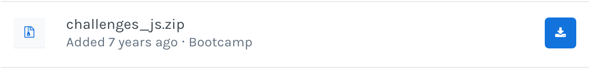
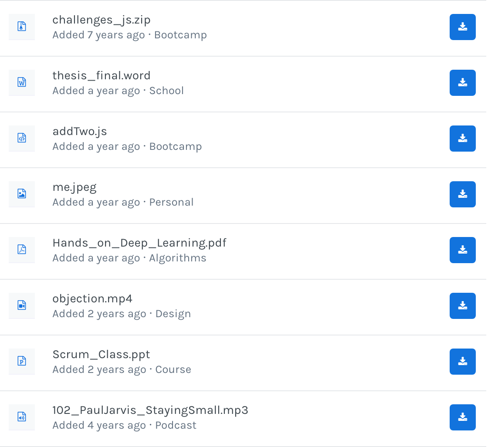
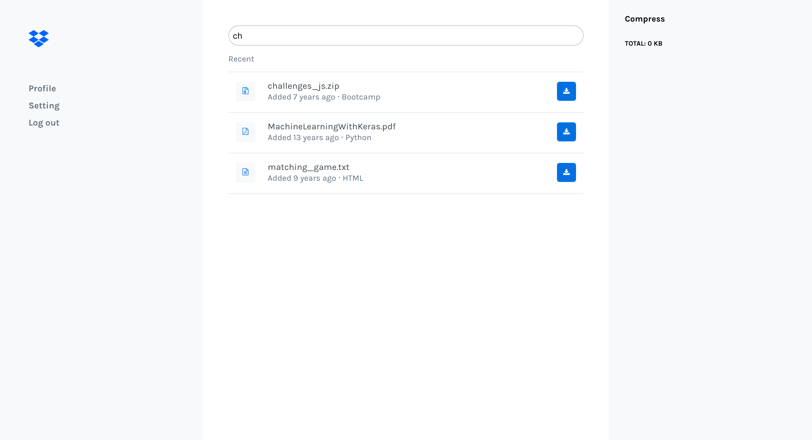

# Dropbox

## Context

[Dropbox](https://www.dropbox.com/) is a file hosting service operated by American company **Dropbox, Inc.** that offers cloud storage, file synchronization, personal cloud, and client software.

## The Assignment

For this assignment, you will focus on creating a React.js application.

### About the Design

If you struggle with the design, you can leave it for last.

### Setup Instructions

In Terminal:

```sh
# (1) Clone the repository
$ git clone https://gitlab.com/agzeri/dropbox--starter-code

# (2) Go inside the directory created
$ cd dropbox--starter-code/starter-code

# (3) Install all dependencies
$ npm install

# (4) Run the application
npm start
```

### Deliverables

+ A GitHub repository called `dropbox--starter-code`
+ You will need to push your code to github

```sh
git add .
git commit -m "«your commit msg»"
git push origin master

```

#### Sprint 1 | Display `Files`

You can use this HTML snippet to display properly each File:

```html
<li className="file__item">
  <div className="grid grid--expanded">
    <div className="grid">
      <span className="file__icon">
        <i className="fa fa-file-text-o"></i>
      </span>
      <p className="file__meta">
        <span className="file__name">redux_in_action_2nd_edition.pdf</span> <br />
        <span>Added 7 years ago · JavaScript</span>
      </p>
    </div>
    <button className="file__button">
      <i className="fa fa-download"></i>
    </button>
  </div>
</li>
```



In your Home component, display as many “File” as elements inside the `files.json` file.



#### Sprint 2 | Implement search bar

Create a Search functionality to perform a search that updates the list of all files.



#### Sprint 3 | Create Download buttons

On your File structure, you need to have button. Use them so that when a user clicks on the button, it adds them on a list on the right called "Compress".

#### Sprint 4 | Display dates in correct format

Display the dates in the correct format, for this you need to use [moment](https://momentjs.com/).

The time format from each object is UNIX. You need to convert them to a more readable and human format.

Read more about momento on the official [documentation](https://momentjs.com/docs/).

#### Sprint 5 | Count the size

You will also need to display the total amount of kbs at the top of the list as a recap.

#### Sprint 6 | BONUS | Compress files

To add a better UX, add some warning to prevent adding twice the same file to the Compress section.

#### Sprint 7 | BONUS | Remove files

Add **remove** functionality from Compress section.

### Expected Results


